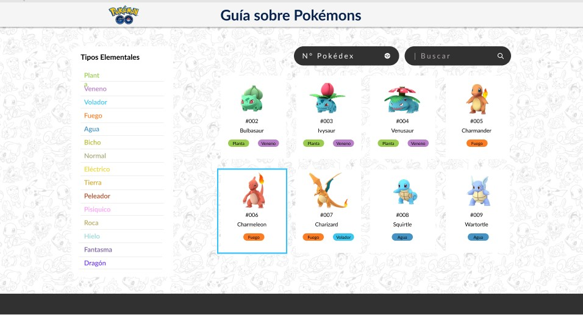
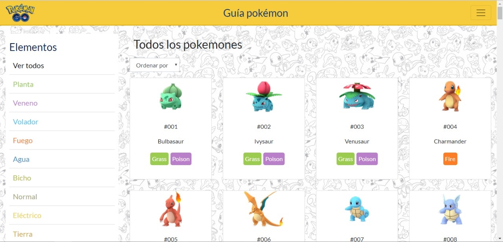

# Guía de pokemones

## Índice

* [Descripción del proyecto](#descripción-general-del-proyecto)
* [Objetivo de la página](#objetivo-de-la-página)
* [Usuario objetivo](#usuario-objetivo)
* [Necesidad del usuario](#necesidad-del-usuario)
* [Historia de usuario](#historia-de-usuario)
* [Diseño de la Interfaz de Usuario](#diseño-de-la-interfaz-de-usuario)
* [Prototipo de baja fidelidad](#prototipo-de-baja-fidelidad)
* [Prototipo de alta fidelidad](#prototipo-de-alta-fidelidad)
* [Test de usabilidad](#test-de-usabilidad)
* [Desarrollo de la interfaz](desarrollo-de-la-interfaz)
* [Diagrama de flujo](#diagrama-de-flujo)
* [Propuesta de proyecto](#propuesta-de-proyecto)

## Descripción general del proyecto

"Guía de pokemones" es una página contenedora de todos los datos necesarios para ser un maestro pokémon. Contiene todas las características e información necesaria para usar en Pokémon GO de los 151 primeros pokemones de la región de Kanto. Puedes encontrar a los personajes mediante filtros (ordenar por número de pokedex, órden alfabético) o por categorías (agua, fuego, hielo, dragón, planta, veneno, etc). Es una web intuitiva y fácil de manejar. Sin necesidad de seguir instrucciones el usuario puede acceder a toda la información que contiene.
***
## Objetivo de la página
Permitir al usuario encontrar información útil para usar en el juego Pokémon GO de manera fácil e intuitiva mediante diferentes categorías, filtros y/o búsqueda por nombre.
***
## Usuario objetivo
Toda persona que juegue Pokémon GO que desee información adicional sobre alguna criatura del juego.
***
## Necesidad del usuario
Se encontró un déficit de páginas enfocadas exclusivamente a las características de los pokemones. Las existentes son de difícil acceso y con mucho lenguaje técnico.
***
## Historias de usuario
**Historia uno**
- Usuario: Kevin, jugador de Pokémon Go.
- Necesita: Conocer las debilidades de sus pokémon.
- Para: Poder ganar batallas en los gimnasios Pokémon.

**Historia dos**
- Usuario: Paula, jugadora de Pokémon Go.
- Necesita: Saber sobre los diferentes tipos de Pokémon y cuantos existen.
- Para: Poder completar su Pokédex.

**Requerimientos**
- Filtrar pokemones según su número de Pokédex
- Mostrar pokemones en orden según Pokédex
- Seleccionar Pokémon específico
- Ver información detallada del Pokémon seleccionado.
- Mostrar información sobre las debilidades de cada Pokémon.

***
## Diseño de la Interfaz de Usuario
**Prototipo de baja fidelidad**
Los primeros acercamientos a la aplicación web se basan en el desplazamiento de la información que contendrá esta misma, además de los elementos que la componen.

Prototipo de baja fidelidad, una serie de sketch que se utilizó para testear como el usuario realiza el recorrido sobre la información contenida dentro de la aplicación, con el objetivo de sacar una serie de conclusiones e implementarlas en el siguiente testeo.

**Prototipo de alta fidelidad**
En este diseño de Interfaz de Usuario se utilizó Figma como herramienta de diseño visual.

https://www.figma.com/file/f83XebnjKNTFLu1Nz4Xaa6NU/Untitled?node-id=75%3A142

***
## Test de usabilidad
**Primer testeo**
Testeo realizado a 4 posibles usuarios con el prototipo mínimo viable

**Objetivos de testeo**
1) Probar la usabilidad de los filtros de la aplicación.
2) Probar si las categorías son las adecuadas.
3) Probar usabilidad de la herramienta “Buscar”.

**Caso a estudiar 1**
- Contexto: A iniciado una nueva incursión en donde sólo puedes utilizar pokemones de la región de Kanto y combatir con ellos en los gimnasios Pokémon, pero ha pasado mucho tiempo y tus pokemones son de distintas regiones, por lo cual se te olvidado las características de estos.
- Pregunta: ¿Cómo lo harías para buscar información sobre un pokemon en especifico y así armar una estrategia de combate?.

**Caso a estudiar 2**
- Contexto: Después de mucho tiempo estas volviendo a retomar el juego y quieres empezar a pelear en gimnasios pero, necesitas saber más sobre las debilidades de tus pokemon para asi poder pelear.
- Pregunta: ¿Cómo buscarías información sobre las debilidades de tus Pokémons?.

**Conclusiones del testeo**
- Ver más elementos que permitan volver a las actividades anteriores.
- Indicar otras formas para volver al inicio.
- Hacer sub categorías por tipo de pokemon.
- Poder acceder a las características de un pokemon si se selecciona su evolución .

**Posibles soluciones**
- Diseñar un botón que vuelva a la página anterior en cada paso.
- Linkear todos los pokemon a la data, incluyendo las evoluciones.
- Incluir breadcrumb (migas de pan), para saber en qué parte se encuentra posicionado el usuario y además poder volver inicio.

**Segundo testeo**
Testeo realizado en el Parque Forestal a 4 posibles usuarios con el prototipo de alta fidelidad.

**Objetivos del testeo**
1) Probar interfaz entre los diferentes accesos a la información de cada Pokémon.
2) Evaluar la importancia del contenido de la información de cada Pokémon.
3) Probar cómo acceder a la información de una categoría en específico.

**Caso a estudiar**
- Contexto: Te gustan mucho los Pokémon de tipo fuego y quieres saber todo sobre ellos.
- Pregunta: ¿Cómo buscarías información sobre los Pokémon tipo fuego?.

**Conclusiones del testeo**
- Dar prioridad a las evoluciones y pre-evoluciones de los Pokémon.
- Agrandar las etiquetas de los Pokemones en pantallas más chicas
- Se presenta de forma directa y clara la información de interés para el usuario.

**Posibles soluciones**
- Sacar información secundaria para priorizar las evoluciones y debilidades de los Pokemon.
- En la versión mobile separar la columna de las categorías de las tarjetas de los pokemones.

***
# Desarrollo de interfaz
## Diagrama de flujo

***

## Propuesta de proyecto

***

